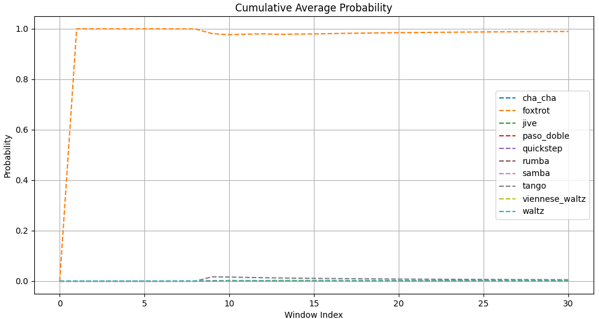

# Ballroom Dance Recognition with Deep Learning

**A deep learning pipeline for classifying ballroom dance music using spectrograms and a lightweight MobileNetV4 model.**

## Overview
**This project provides a complete pipeline for:**

+ Preprocessing ballroom dance music files into time-series spectrograms.
+ Training a lightweight MobileNetV4 model to classify 10 ballroom dances.
+ Evaluating songs with per-window predictions and cumulative analysis.

**The system uses:**

+ Parallelized data loading for memory efficiency.
+ Spectrogram augmentation (noise, masking) to improve robustness.
+ Binary storage (.npy) for compact and fast data access.
## Key Features
**Modular design:**
+ Audio loading → window splitting → spectrogram generation → JSON metadata → model training.
+ Efficient training:
+ Uses ThreadPoolExecutor for parallel processing.

**Augmentation:**
Gaussian noise, time/frequency masking applied directly to spectrograms.

**Lightweight model:**
MobileNetV4-Conv-Small (10 outputs for 10 dance types).

## Usage
1. Load or train your model and place it in `models` (configurable, see globals.py)
1. Get any *.mp3 file
1. Run: `python predict.py --model=<model name> --song=<path to mp3 file>`

### Example
```bash
python predict.py --song="The 'Pink Panther' Theme – Sf29i Tanzorchester Klaus Hallen.mp3"
```




## Data preparation
1. Download .mp3 files anywhere you want. I used music from:
   + [Ballroom dancing music playlist](https://music.youtube.com/playlist?list=PLYUR6eecHWW2UIevwbDR-N9LpQ2ayAwcm)
   + [Telegram channel](https://t.me/my_ballroom_music)
   
   (Approximately 200 songs from each source.)
1. Files should be named: `artist - title - dance.mp3` . See `data_processor.py` for correct dance labels or to change them. Dance label must always be after last `-`, other rules are optional and for more accurate duplication check. You can see my dataset files at `sources/dataset.txt`
1. Run: `python data_processor.py`
1. Spectrograms will be saved to `binary` in `.npy` format, labels will be in `data/<dance>/*.json`

## Training
1. Specify model save name in `train.py`
1. Optionally set custom batch size, learning rate, epochs, torch device (if available, it will use CUDA by default)
1. Run: `python train.py`

## Models
I provide one model: `models/mobilenetv4_dance_classifier_noised_v2.pth`, achieving ~98% accuracy on the final dataset.
It was trained with next parameters:
+ learning rate: 1e-4
+ batch: 64
+ epochs: 
  + 10 on 200 songs without augmentation
  + 7 on 400 songs with augmentation

## Note 
I am not an ML engineer—this code was written with enthusiasm and may contain bad practices or code quality issues. However, I’m striving to make these complex tasks work effectively.

## Credits
Code of `mobilenetv4.py` was adapted from [d-li14/mobilenetv4.pytorch](https://github.com/d-li14/mobilenetv4.pytorch) repo